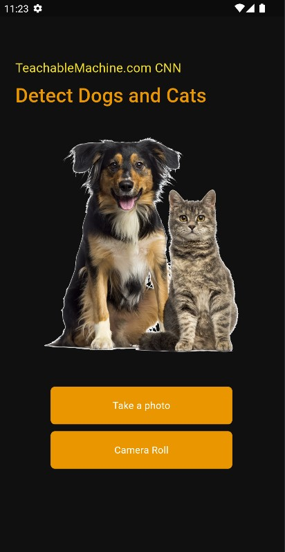

# Cat vs Dog Detection App

A Flutter application for detecting cats and dogs using deep learning.

 

## Introduction

The Cat vs Dog Detection App is a mobile application developed using Flutter that leverages deep learning models to classify images as either a cat or a dog. 
This app demonstrates the integration of machine learning with mobile development to create intelligent applications.

## Features

- Image classification for cats and dogs
- Real-time detection using the device camera
- User-friendly interface
- Offline functionality

## Installation

To get started with the Cat vs Dog Detection App, follow these steps:

1. **Clone the repository:**
   ```sh
   git clone https://github.com/azizbek-kobilov/catvsdog.git
   cd catvsdog
   ```

2. **Install dependencies:**
   ```sh
   flutter pub get
   ```

3. **Run the app:**
   ```sh
   flutter run
   ```

## Usage

1. Open the app on your mobile device.
2. Use the camera button to capture an image or select an image from the gallery.
3. The app will process the image and display whether it is a cat or a dog.
